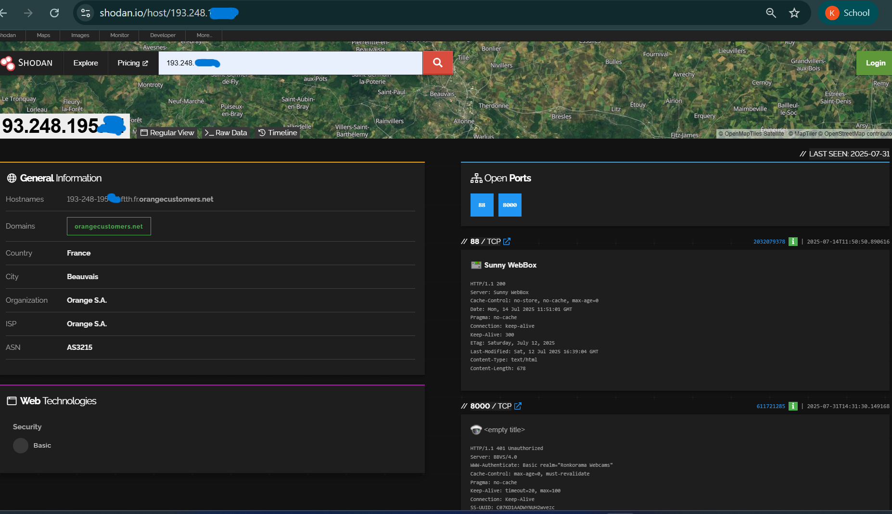

# Assignment 20: Check Internet Exposure via Shodan

**Name:** Kuragayala Rachel  
**Register Number:** 2462106  

---

##  📌 Objective

The goal of this assignment is to simulate an attacker’s perspective by using [Shodan.io](https://shodan.io) to analyze a public IP address, identify exposed services, and suggest measures to secure the system.

---  
**Analyzed IP Address (masked):** `193.248.xxx.54`   
**Hostname:** `193-248-195-54.ftth.fr.orangecustomers.net`  
**Location:** Beauvais, France  
**ISP / Organization:** Orange S.A.  
**Domain:** `orangecustomers.net`

---

## 🛠️ Methodology

1. Checked my own public IP on Shodan – returned **no results**.
2. Used a different public IP (`193.248.195.xx`) found using Shodan search filters (webcams).
3. Gathered banner information, HTTP headers, and service data.
4. Analyzed the type of services exposed and assessed security risks.
5. Documented results in this report, masking the real IP for privacy.

---

## 🌐 Findings from Shodan

### ✅ General Information

- **IP Address:** (masked: `193.248.xxx.54`)
- **City:** Beauvais, France  
- **ISP / Org:** Orange S.A.  
- **Hostname:** `193-248-195-xx.ftth.fr.orangecustomers.net`  
- **Domain:** `orangecustomers.net`  
- **ASN:** AS3215
- 

## 🖼️ Screenshot of Shodan Result  
*(IP address masked for privacy)* 

### 🔓 Open Ports and Services

| Port | Service              | Description                                                              |
|------|----------------------|--------------------------------------------------------------------------|
| 88   | Sunny WebBox         | HTTP web interface for solar inverter device. Server: `Sunny WebBox`     |
| 8000 | Webcam Interface     | HTTP Basic Auth realm: `"Ronkorama Webcams"` - Server: `BBVS/4.0`         |

---

## 📊 Service Details

### 🌞 Port 88 – Sunny WebBox

- **HTTP Response:** `200 OK`
- **Server Header:** `Sunny WebBox`
- **Last Modified:** `Sat, 12 Jul 2025`
- **Security Issue:** Uses plain HTTP, not HTTPS. Possibly outdated firmware.

### 📹 Port 8000 – Webcam Service

- **HTTP Response:** `401 Unauthorized`
- **Auth Required:** Basic HTTP Authentication
- **Realm:** `"Ronkorama Webcams"`
- **Server Header:** `BBVS/4.0`
- **Security Issue:** Uses HTTP with no encryption; login credentials are exposed if intercepted.

---

## ⚠️ Security Analysis

- **Unencrypted Traffic:** Both services run over HTTP, not HTTPS — vulnerable to data interception.
- **Weak Authentication:** Webcam uses Basic Auth — risky if default credentials are used.
- **Exposed IoT Devices:** Systems like Sunny WebBox have a history of vulnerabilities.
- **Public Accessibility:** Services are accessible from anywhere — no IP filtering or firewall.

---

## 🔐 Recommendations

| Area              | Recommendation                                                              |
|-------------------|-----------------------------------------------------------------------------|
| 🔑 Authentication | Change default credentials; disable Basic Auth if possible                  |
| 🔒 Encryption      | Enable HTTPS with proper TLS certificates                                   |
| 🚫 Access Control | Use firewall or router rules to block public access to ports 88 and 8000    |
| 🧰 Updates         | Update firmware/software of Sunny WebBox and webcam system                 |
| 🧱 Network Design  | Place devices behind a VPN or private subnet                                |
| 🧪 Monitoring       | Regularly check Shodan or similar tools for accidental exposures           |

---
## 💾 Code / Tools Used

- **Shodan Web Interface**: [https://shodan.io](https://shodan.io)  
- **Screenshot Tool**: Snipping Tool (Windows)  
- No custom code or scripts were used for this assignment.

---

## ✅ Conclusion

This assignment demonstrates how attackers can use tools like Shodan to find exposed systems online. The IP analyzed had a solar inverter and webcam interface exposed without encryption or strong authentication. Simple configuration changes such as firewalls, firmware updates, and HTTPS enforcement could significantly reduce the risk.

